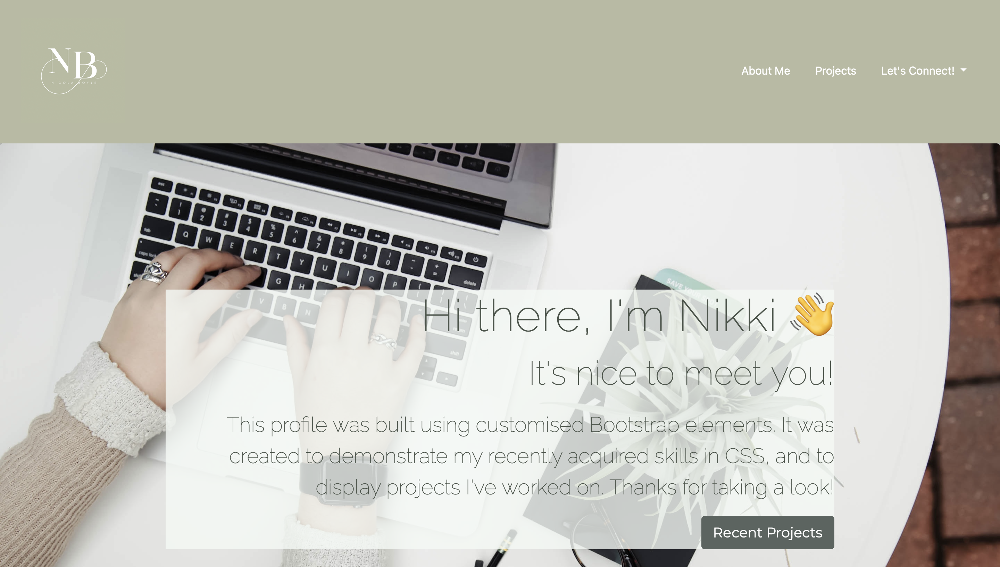

## JavaScript Password Generator

## **What**
For this challenge, I was tasked with building a profile page using Boostrap components which I customised to suit my own theme, and to make the page more interesting and user friendly. I needed to ensure the page met the following criteria:

    -Using Bootstrap, recreate your portfolio site with the following items:
    -A navigation bar
    -A navigation menu at the top. Feel free to use the navbar code provided in Bootstrap's documentation, or create your own navbar by applying the correct Bootstrap classes to your HTML.
    -Include links that are applicable to your portfolio.
    -Links should navigate to the appropriate sections
    -A hero section
    -A jumbotron featuring your picture, your name, and any other information you'd like to include.
    -A work section
    -A section displaying your work in grid.
    -If you need to use placeholder image use placehold.co Links to an external site.
    -Use Bootstrap cards for each project.
    -The description should give a brief overview of the work.
    -Each project will eventually link to your class project work!
    -A skills section
    -List out the skills you expect to learn from the bootcamp.
    -An about/contact section
    -An About Me section in the same row.
    -A footer section
    -All hyperlinks should have a hover effect.
    -All buttons should display a box shadow upon hover.

## **How**
I inserted the relevant link to incorporate Boostrap into my app, and then began to choose the correct components to place into the index file.

Once I had all of my components, I entered all of the content and information required to flesh out the app.

After this, I created a CSS stylesheet and began to target each specific component with styling to suit my own taste, as well as ensuring it met the guidelines of the challenge.

## **Result**

The GitHub repository link:

https://github.com/Nikki1162/Password-Generator

The live application:

https://nikki1162.github.io/Password-Generator/

